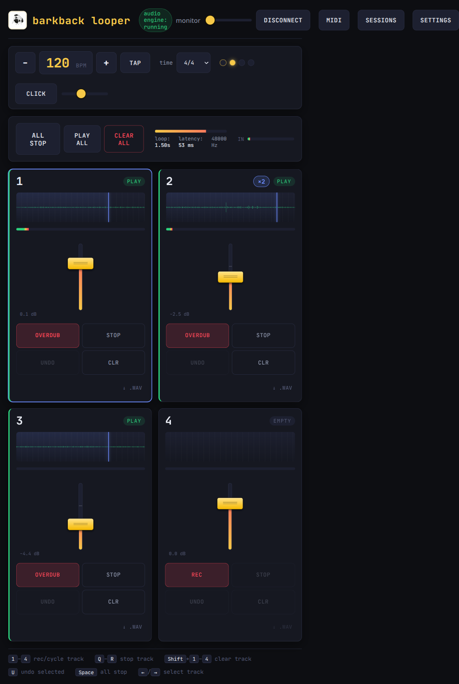

# Barkback Looper

<p align="center">
  
</p>

This is a web-based looper inspired by the RC-505 mk2 (which I don't have) and other similar things. I'm building it to use on my touch-screen, so maybe it'll work in a tablet. Also I'll be trying out my midi pedal.



## Run it

```bash
npm install
npm run dev
```

Then open the printed URL, click **Connect input**, grant mic access, and tap REC on track 1.

## Build

```bash
npm run build
npm run preview
```
